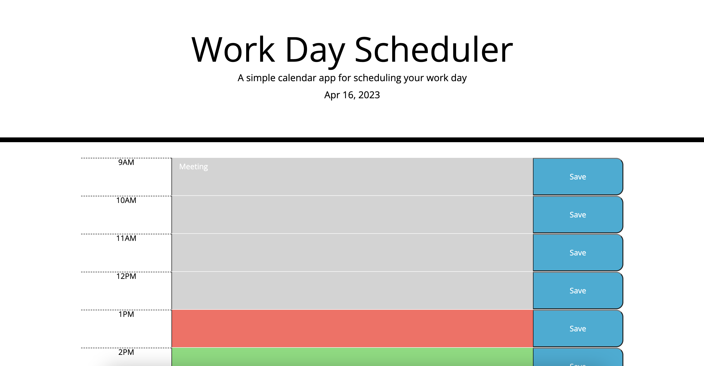

# Daily-Planner

## Description

This website showcases a daily planner. The user could use this website to plan out their day. The date at the top of the website changes to match the current date. The user could click on any box next to the timeframe to enter in any schedule they may have. Once the user clicks the save button, the website will be saved to local storage and the event will still be there even if the page is refreshed. This website contains notes on HTML, CSS, and JavaScript. 
Here is the link to the website: https://jssoyoung.github.io/Daily-Planner/
Here is an image of the website: 

## Installation

N/A

## Usage

The website is divided into different sections. The header of the website includes the title, description of the page and the date. The date changes according to match the current date. The body of this website holds a container. The container is divided into the different hours in a work day (9am-5pm). The user could click on the text box next to the hour they choose. An event could then be written in and saved. Once saved, the event is also saved to the local storage and will continue to be there even after the page is refreshed.

## Credits

N/A 

## License

Please refer to the LICENSE in the repo.